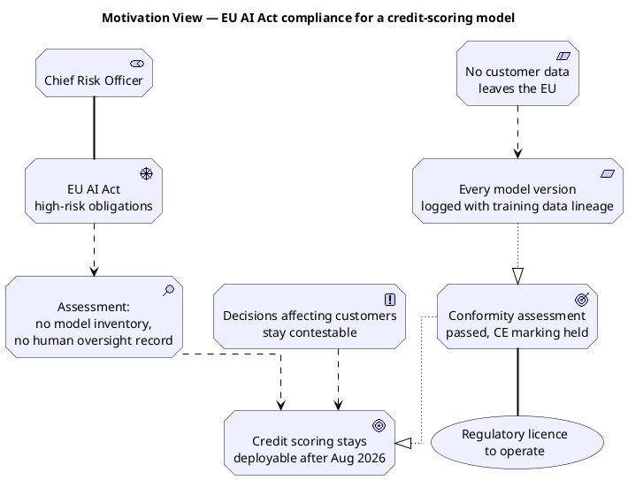
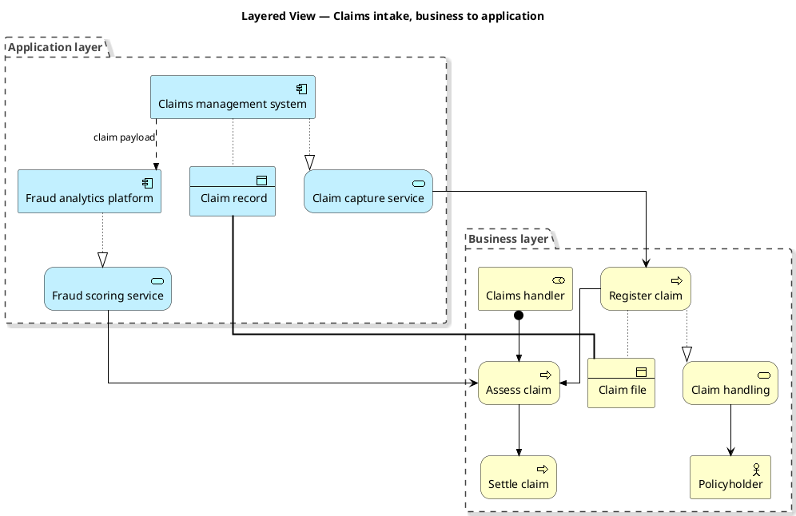
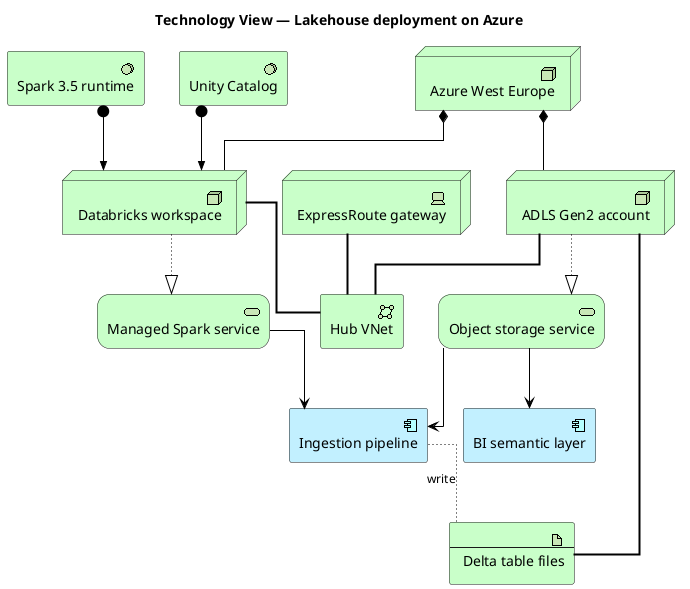

# ArchiMate in PlantUML: the Hosiaisluoma stdlib

ArchiMate is this wiki's primary PlantUML track. Every ArchiMate diagram uses the **Archimate-PlantUML** stdlib (Hosiaisluoma), bundled inside `wiki/.obsidian/plantuml/plantuml.jar`. No network access, no external include.

**Verified against:** stdlib `Archimate-PlantUML` version **3.2.2**, shipped in PlantUML **1.2026.5** (jar at `wiki/.obsidian/plantuml/plantuml.jar`). Every macro below was rendered from that jar and the PNG inspected. Macros that did not render are listed in "Macros that do not exist" at the end, not in the tables.

---

## Preamble

```plantuml
@startuml
!include <archimate/Archimate>
title <descriptive title>
skinparam linetype ortho
@enduml
```



Four lines, in that order. `title` sets the figure heading. `skinparam linetype ortho` forces right-angle routing, which is what makes a layered view readable; without it PlantUML draws curves and the layers blur.

Optional preamble switches:

| Directive | Effect |
|---|---|
| `LAYOUT_TOP_DOWN()` | `top to bottom direction`. The PlantUML default. |
| `LAYOUT_LEFT_RIGHT()` | `left to right direction`. Use for value streams and process chains. |
| `LAYOUT_AS_SKETCH()` | Handwritten style plus a red "needs to be validated" footer. Use for workshop drafts. |
| `!global $ARCH_SPECIAL_SHAPES = %true()` | Switches 12 elements to their classic UML-ish shapes. Must sit **before** the `!include`. |

`$ARCH_SPECIAL_SHAPES` defaults to false, and every diagram in this wiki leaves it off. With it on, `Technology_Node` becomes a 3D box, `Strategy_ValueStream` a chevron, `Business_Service` an ellipse, `Business_Actor` a stick figure, `Motivation_Stakeholder` a cylinder. The twelve elements it affects are `Application_Service`, `Business_Actor`, `Business_Product`, `Business_Role`, `Business_Service`, `Motivation_Meaning`, `Motivation_Stakeholder`, `Motivation_Value`, `Strategy_ValueStream`, `Technology_Artifact`, `Technology_Node`, `Technology_Service`. Default off gives uniform rounded rectangles with a corner glyph, which reads better in a dense view and matches the rest of the wiki.

---

## Element macros

Shape: `<Layer>_<Element>(alias, "label")`. The alias is a bare identifier, unquoted, unique per diagram. The label is quoted; `\n` breaks the line. A third positional argument `$nest` exists in the signature but the 3.2.2 bodies ignore it, so do not pass it.

Each layer gets a fill colour automatically. Do not override it.

### Motivation (lilac)

| Macro | ArchiMate element |
|---|---|
| `Motivation_Stakeholder` | Stakeholder |
| `Motivation_Driver` | Driver |
| `Motivation_Assessment` | Assessment |
| `Motivation_Goal` | Goal |
| `Motivation_Outcome` | Outcome |
| `Motivation_Principle` | Principle |
| `Motivation_Requirement` | Requirement |
| `Motivation_Constraint` | Constraint |
| `Motivation_Meaning` | Meaning |
| `Motivation_Value` | Value |

### Strategy (orange)

| Macro | ArchiMate element |
|---|---|
| `Strategy_Resource` | Resource |
| `Strategy_Capability` | Capability |
| `Strategy_CourseOfAction` | Course of Action |
| `Strategy_ValueStream` | Value Stream |

### Business (yellow)

| Macro | ArchiMate element |
|---|---|
| `Business_Actor` | Business Actor |
| `Business_Role` | Business Role |
| `Business_Collaboration` | Business Collaboration |
| `Business_Interface` | Business Interface |
| `Business_Process` | Business Process |
| `Business_Function` | Business Function |
| `Business_Interaction` | Business Interaction |
| `Business_Event` | Business Event |
| `Business_Service` | Business Service |
| `Business_Object` | Business Object |
| `Business_Contract` | Contract |
| `Business_Representation` | Representation |
| `Business_Product` | Product |
| `Business_Location` | Location, business-coloured |

### Application (blue)

| Macro | ArchiMate element |
|---|---|
| `Application_Component` | Application Component |
| `Application_Collaboration` | Application Collaboration |
| `Application_Interface` | Application Interface |
| `Application_Function` | Application Function |
| `Application_Interaction` | Application Interaction |
| `Application_Process` | Application Process |
| `Application_Event` | Application Event |
| `Application_Service` | Application Service |
| `Application_DataObject` | Data Object |

`Application_DataObject` is the only spelling. `Data_Object` does not exist.

### Technology (light green)

| Macro | ArchiMate element |
|---|---|
| `Technology_Node` | Node |
| `Technology_Device` | Device |
| `Technology_SystemSoftware` | System Software |
| `Technology_Collaboration` | Technology Collaboration |
| `Technology_Interface` | Technology Interface |
| `Technology_Path` | Path |
| `Technology_CommunicationNetwork` | Communication Network |
| `Technology_Function` | Technology Function |
| `Technology_Process` | Technology Process |
| `Technology_Interaction` | Technology Interaction |
| `Technology_Event` | Technology Event |
| `Technology_Service` | Technology Service |
| `Technology_Artifact` | Artifact |

### Physical (bright green)

| Macro | ArchiMate element |
|---|---|
| `Physical_Equipment` | Equipment |
| `Physical_Facility` | Facility |
| `Physical_DistributionNetwork` | Distribution Network |
| `Physical_Material` | Material |

### Implementation and Migration (pink)

| Macro | ArchiMate element |
|---|---|
| `Implementation_WorkPackage` | Work Package |
| `Implementation_Deliverable` | Deliverable |
| `Implementation_Event` | Implementation Event |
| `Implementation_Plateau` | Plateau |
| `Implementation_Gap` | Gap |

### Other

| Macro | ArchiMate element |
|---|---|
| `Other_Location` | Location |
| `Other_Grouping` | Grouping, transparent fill |
| `Junction_And(alias, "label")` | And junction, filled circle |
| `Junction_Or(alias, "label")` | Or junction, hollow circle |

Junctions take a label like any other element, and the label **must not be empty**. `Junction_And(j1, "")` is a syntax error in 3.2.2. Pass a single space, `Junction_And(j1, " ")`, when the junction should be unlabelled.

---

## Relationship macros

Shape: `Rel_<Type>(source, target)` or `Rel_<Type>(source, target, "label")`. Every base macro takes exactly two aliases plus an optional label.

Direction matters. All of these read **source first**, which is the ArchiMate reading of the relationship, and every one except `Rel_Access` and `Rel_Association` draws its decoration on one end only.

| Macro | Notation observed | Reads as | Directional |
|---|---|---|---|
| `Rel_Composition(A, B)` | Filled diamond at A, solid line | A is composed of B; A is the whole | Yes |
| `Rel_Aggregation(A, B)` | Hollow diamond at A, solid line | A aggregates B | Yes |
| `Rel_Assignment(A, B)` | Filled ball at A, filled arrowhead at B | A is assigned to B; active element to the behaviour it performs | Yes |
| `Rel_Realization(A, B)` | Dotted line, hollow triangle at B | A realises B; the concrete points at the abstract | Yes |
| `Rel_Serving(A, B)` | Solid line, open arrowhead at B | A serves B; B consumes what A provides | Yes |
| `Rel_Triggering(A, B)` | Solid line, filled arrowhead at B | A triggers B; temporal or causal sequence | Yes |
| `Rel_Flow(A, B)` | Dashed line, filled arrowhead at B | Something flows from A to B | Yes |
| `Rel_Specialization(A, B)` | Solid line, hollow triangle at B | A is a specialisation of B | Yes |
| `Rel_Influence(A, B)` | Dashed line, open arrowhead at B | A influences B; motivation layer only | Yes |
| `Rel_Access(A, B)` | Dotted line, no arrowhead | A accesses B, mode unspecified | No |
| `Rel_Access_r(A, B)` | Dotted line, arrowhead back at A | A reads B | Yes |
| `Rel_Access_w(A, B)` | Dotted line, arrowhead at B | A writes B | Yes |
| `Rel_Access_rw(A, B)` | Dotted line, arrowheads at both ends | A reads and writes B | Both |
| `Rel_Association(A, B)` | Plain solid line | A is associated with B | No |
| `Rel_Association_dir(A, B)` | Solid line, half arrowhead at B | Directed association, A to B | Yes |

The two traps: `Rel_Realization` and `Rel_Serving` point the opposite way from how people say the sentence. "The component realises the service" is `Rel_Realization(component, service)`, and the triangle lands on the service. "The process uses the application service" is `Rel_Serving(app_service, process)`, source is the provider.

### Forcing an edge direction

Every relationship macro has four suffixed variants that override graphviz's routing: `_Up`, `_Down`, `_Left`, `_Right`. So `Rel_Serving_Up(as1, p1)` draws the same relationship but pins the target above the source. Sixty of these exist, one set per relationship type. Reach for them only after `skinparam linetype ortho` and the grouping blocks have failed to produce a readable layout, because they make the source brittle: change one element and the pinned edges fight each other.

---

## Grouping and boundaries

Four constructs, all rendering as a container you open with `{` and close with `}`:

| Macro | Renders as | Use for |
|---|---|---|
| `Group(alias, "label")` | Solid grey folder with a tab | A hard organisational or ownership boundary |
| `Grouping(alias, "label")` | Dashed folder with a tab | The ArchiMate Grouping element: a logical cluster, a layer band |
| `Boundary(alias, "label")` | Dashed rectangle, bold centred heading | A scope or trust boundary around components |
| `Other_Grouping(alias, "label")` | Transparent dotted box, no nesting | A grouping element that stands alone as a node |

```plantuml
Grouping(ga, "Application layer") {
  Application_Component(cms, "Claims management system")
  Application_Service(as1, "Claim capture service")
}
```

Declare relationships **outside** the block, after all containers are closed. Nesting relationship macros inside a container works but makes the source harder to reorder.

`Group`, `Grouping` and `Boundary` accept nested elements. `Other_Grouping` does not: it is a plain element you connect with relationships, which is what you want when the grouping is itself a modelled thing rather than a visual band.

---

## Layout control

Four tools, in the order you should try them:

1. **`skinparam linetype ortho`** in the preamble. Always. Right-angle edges.
2. **Declaration order.** Graphviz lays out roughly in declaration order along the rank direction. Declare the top layer first when running top-down.
3. **`LAYOUT_LEFT_RIGHT()` / `LAYOUT_TOP_DOWN()`.** Switch the rank direction for the whole diagram. Value streams and process chains read left to right; layered views read top-down.
4. **Hidden layout edges: `Lay_U`, `Lay_D`, `Lay_L`, `Lay_R`.** `Lay_D(a, b)` emits `a -[hidden]D- b`, which forces b below a without drawing anything. This is the escape hatch when a grouping lands in the wrong place. Same brittleness warning as the `_Up`/`_Down` relationship variants.

Layer stacking is the recurring layout problem. Graphviz has no concept of ArchiMate layers, so a business-to-application view can come out with the application layer above the business layer. Fix it with declaration order first, then `Lay_D` between the grouping aliases, and only then with directional relationship variants.

---

## Worked example 1: motivation view

The entry view for any change. Hosiaisluoma's rule is to build one before any build-or-buy action. The cascade is Stakeholder to Driver to Assessment to Goal, with Outcome and Requirement realising downward, and Principle and Constraint influencing sideways.



Render check: nine lilac motivation elements, each with its corner glyph. `Rel_Influence` draws dashed with an open arrowhead, `Rel_Realization` dotted with a hollow triangle on the Goal and on the Outcome, `Rel_Association` plain. 668 × 525 px.

---

## Worked example 2: layered business-to-application view

Two `Grouping` bands, business behaviour on top, application realisation below. This is the shape most `sources/` and `cases/` pages need.



Render check: two dashed folders, business yellow and application blue, seven and five elements. `Rel_Assignment` draws a filled ball on the Claims handler, `Rel_Flow` a labelled dashed arrow between the two components, `Rel_Access` dotted. 1124 × 624 px. Graphviz placed the application band above the business band despite the declaration order; add `Lay_D(gb, ga)` if the stacking must be business-on-top.

---

## Worked example 3: technology and deployment view

Nodes composed under a region, system software assigned to nodes, technology services realised by nodes and serving application components.



Render check: ten green technology elements and two blue application components. `Technology_Node` shows the 3D-box glyph, `Technology_Device` a monitor, `Technology_SystemSoftware` a circle, `Technology_Artifact` a document, `Technology_CommunicationNetwork` a network glyph. `Rel_Composition` puts a filled diamond on the region node. The labelled `Rel_Access` renders dotted with the label "write". 625 × 565 px.

---

## Macros that do not exist in 3.2.2

Three names appear in this wiki's existing cookbook pages and are **not** defined by the bundled stdlib. Each one is a hard syntax error: PlantUML aborts the whole diagram and emits a green-on-black error image, so a page carrying one shows no diagram at all.

| Written | Actual macro | Occurrences in `wiki/` |
|---|---|---|
| `Rel_Used_By(A, B)` | `Rel_Serving(A, B)`, same direction | 32, across 4 cookbook pages |
| `Rel_Trigger(A, B)` | `Rel_Triggering(A, B)` | 8, across 3 cookbook pages |
| `Data_Object(a, "…")` | `Application_DataObject(a, "…")` | 15, across 4 cookbook pages |

All 55 occurrences sit in five of the six `wiki/sources/hosiaisluoma-cookbook-*.md` pages. `hosiaisluoma-cookbook-motivation-and-strategy-views.md` carries none. They were written against an older Archimate-PlantUML macro set. When editing those pages, substitute per the table.

Other names worth not guessing at: there is no `Business_Value` (it is `Motivation_Value`), no `Technology_Equipment` (it is `Physical_Equipment`), no `Strategy_Value`, and no generic `Location` (it is `Other_Location` or `Business_Location`).

---

## Verification

Every ArchiMate diagram gets rendered before it ships. The loop, the commands and the toolchain are in `rendering-and-verification.md`. In one line: write the `@startuml…@enduml` block to a temp file outside `wiki/`, run

```bash
java -jar wiki/.obsidian/plantuml/plantuml.jar -tpng /tmp/<name>.puml
```

read the PNG, then delete the temp file. A green-on-black image with a line number is a syntax error, not a diagram.
