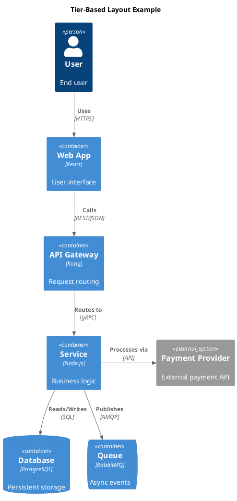
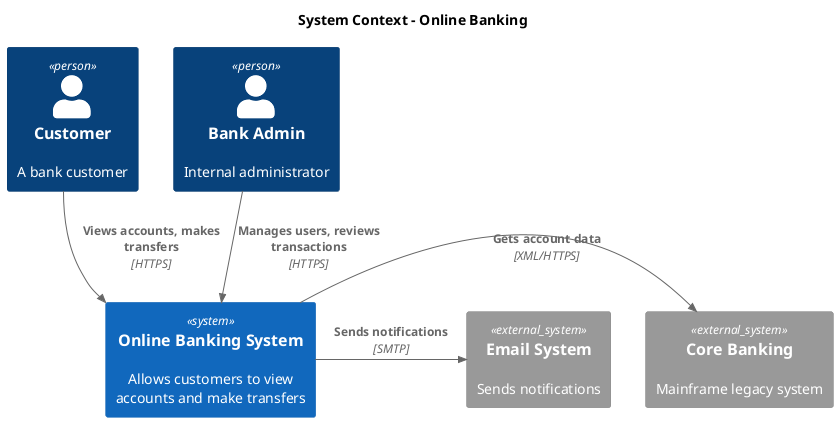
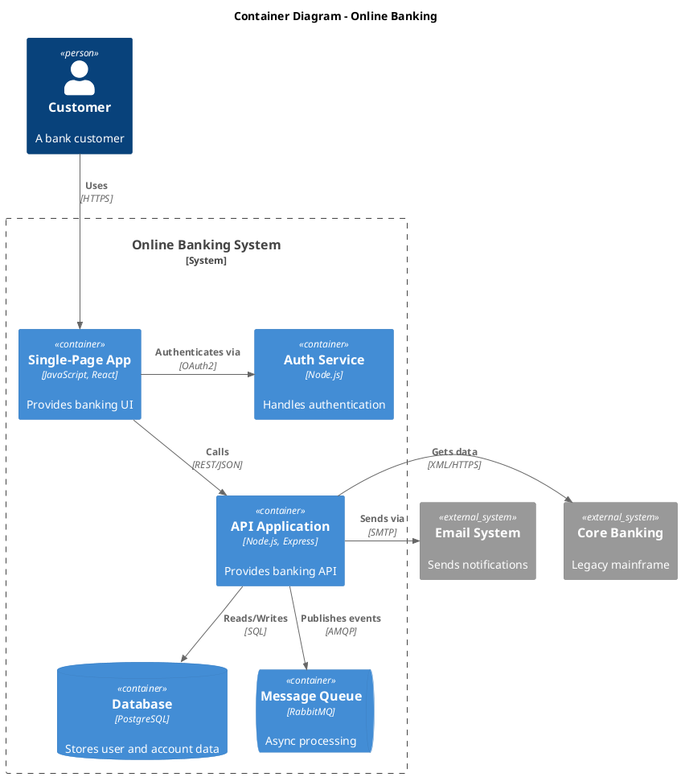
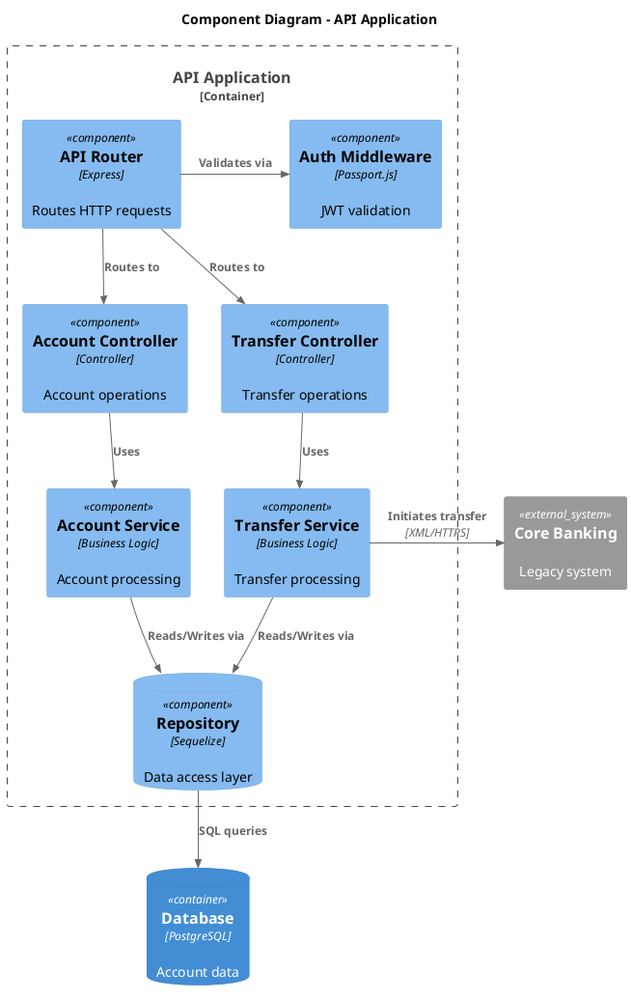

<!-- Adapted from tractorjuice/arc-kit, plugins/arckit-claude/skills/plantuml-syntax (MIT); ArcKit adapted it from SpillwaveSolutions/plantuml. -->

# C4-PlantUML Reference

The C4-PlantUML library extends PlantUML with macros for C4 model architecture diagrams. This reference covers element syntax, relationship directions, layout constraints, and the layout conflict rules that keep the layout engine from producing unreadable output.

**Library**: [plantuml-stdlib/C4-PlantUML](https://github.com/plantuml-stdlib/C4-PlantUML)

**Local rendering**: this wiki renders PlantUML through the bundled JAR at `wiki/.obsidian/plantuml/plantuml.jar`, PlantUML v1.2026.5. C4-PlantUML ships inside that JAR as the `c4` stdlib package, so every include below resolves offline.

---

## 1. Includes

Use the local stdlib form. One include per diagram type; the angle-bracket syntax reads the copy bundled in the JAR.

```plantuml
' Context Diagram (Level 1)
!include <C4/C4_Context>

' Container Diagram (Level 2)
!include <C4/C4_Container>

' Component Diagram (Level 3)
!include <C4/C4_Component>

' Deployment Diagram
!include <C4/C4_Deployment>

' Dynamic Diagram
!include <C4/C4_Dynamic>
```

**Container includes Context**, and **Component includes Container**, so one include per diagram is enough.

### Why not the URL form

Upstream C4-PlantUML documentation and most examples on the web use a remote include:

```plantuml
' Upstream form. Do not use here.
!include https://raw.githubusercontent.com/plantuml-stdlib/C4-PlantUML/master/C4_Container.puml
```

That form fetches the macro file over HTTPS at render time. Behind a corporate firewall, on a plane, or with GitHub raw blocked, the fetch fails and the whole diagram renders as an error box. The failure is silent in the sense that the PlantUML source is fine: only the network is missing. The local stdlib form has no such dependency. Rewrite any pasted upstream snippet to `<C4/C4_...>` before committing it.

The tradeoff: the stdlib copy is pinned to whatever C4-PlantUML version was current when the JAR was built, so a macro added upstream after that point will not resolve. Verified working in the bundled copy: element tags (`AddElementTag`, `$tags=`), `ContainerQueue`, `SystemQueue`, `Rel_Neighbor`, `Lay_Distance`, `SHOW_LEGEND()`. If a macro is missing, upgrade the JAR rather than reintroducing the URL.

---

## 2. Element Syntax

### Context-Level Elements

| Macro | Description | Parameters |
|-------|-------------|------------|
| `Person(alias, label, description)` | A person/user interacting with the system | alias, label, description |
| `Person_Ext(alias, label, description)` | An external person | alias, label, description |
| `System(alias, label, description)` | The system being described | alias, label, description |
| `System_Ext(alias, label, description)` | An external system | alias, label, description |
| `SystemDb(alias, label, description)` | A database system | alias, label, description |
| `SystemDb_Ext(alias, label, description)` | An external database system | alias, label, description |
| `SystemQueue(alias, label, description)` | A queue system | alias, label, description |
| `SystemQueue_Ext(alias, label, description)` | An external queue system | alias, label, description |

### Container-Level Elements

| Macro | Description | Parameters |
|-------|-------------|------------|
| `Container(alias, label, technology, description)` | A container (application, service) | alias, label, tech, description |
| `ContainerDb(alias, label, technology, description)` | A database container | alias, label, tech, description |
| `ContainerQueue(alias, label, technology, description)` | A message queue container | alias, label, tech, description |
| `Container_Ext(alias, label, technology, description)` | An external container | alias, label, tech, description |
| `ContainerDb_Ext(alias, label, technology, description)` | An external database | alias, label, tech, description |
| `ContainerQueue_Ext(alias, label, technology, description)` | An external queue | alias, label, tech, description |

### Component-Level Elements

| Macro | Description | Parameters |
|-------|-------------|------------|
| `Component(alias, label, technology, description)` | A component within a container | alias, label, tech, description |
| `ComponentDb(alias, label, technology, description)` | A database component | alias, label, tech, description |
| `ComponentQueue(alias, label, technology, description)` | A queue component | alias, label, tech, description |
| `Component_Ext(alias, label, technology, description)` | An external component | alias, label, tech, description |
| `ComponentDb_Ext(alias, label, technology, description)` | An external database component | alias, label, tech, description |

### Parameter counts: what is actually required

A claim circulates that "Context macros take 3 parameters, Container and Component take 4", usually offered as the fix for a `Syntax error: )`. That reading is wrong, and this file's own examples show why: section 4 states the `protocol` parameter of `Rel` is optional and then uses `Rel_Down(api, db, "Reads/Writes")` with three arguments. Trailing parameters in C4-PlantUML are optional throughout, element macros included.

Rendered against the bundled JAR at v1.2026.5, all of these draw without error:

```plantuml
Person(p2, "Two args only")
System(s2, "Sys two args")
Container(c2, "Cont two args")
Container(c3, "Cont three args", "Java")
Container(c4, "Cont four args", "Java", "desc here")
```

The real contract:

- `alias` and `label` are required. Everything after them is optional and simply renders empty when omitted.
- The table columns above are the **canonical maximum positional shape**, not a required arity. Write the full shape anyway: a container with no technology and no description carries almost no information.
- Named optional arguments extend past the positional ones: `$sprite`, `$tags`, `$link`. Example: `Container(c, "C", "Java", "desc", $tags="v1")`.

So a `Syntax error: )` on an element macro is almost never a parameter *count* problem. Look instead for an unescaped comma or unbalanced quote inside a label, or a stray `)` closing the wrong macro.

---

## 3. Boundary Syntax

Boundaries group related elements visually:

```plantuml
System_Boundary(alias, label) {
    ' Elements inside this boundary
    Container(web, "Web App", "React", "User interface")
    Container(api, "API", "Node.js", "Business logic")
}

Container_Boundary(alias, label) {
    ' Components inside this container
    Component(ctrl, "Controller", "Express", "HTTP handlers")
    Component(svc, "Service", "Business Logic", "Core processing")
}

Enterprise_Boundary(alias, label) {
    ' Systems inside this enterprise
    System(crm, "CRM", "Customer relationship management")
    System(erp, "ERP", "Enterprise resource planning")
}
```

**Nesting**: boundaries nest. `System_Boundary` inside `Enterprise_Boundary`, `Container_Boundary` inside `System_Boundary`.

---

## 4. Directional Relationships

Directional relationship macros control how the layout engine positions elements relative to each other.

### Relationship Macros

| Macro | Effect | Use For |
|-------|--------|---------|
| `Rel(from, to, label, protocol)` | Generic relationship (no layout hint) | **Avoid** — prefer directional variants |
| `Rel_Down(from, to, label, protocol)` | Places `from` above `to` | Hierarchical tiers (user above system, API above database) |
| `Rel_Up(from, to, label, protocol)` | Places `from` below `to` | Callbacks, reverse dependencies |
| `Rel_Right(from, to, label, protocol)` | Places `from` left of `to` | Horizontal data flow (left-to-right reading) |
| `Rel_Left(from, to, label, protocol)` | Places `from` right of `to` | Reverse horizontal flow |
| `Rel_Neighbor(from, to, label, protocol)` | Forces `from` and `to` adjacent | Tightly coupled components |

**Best practice**: give every relationship a directional variant. Generic `Rel` gives the layout engine no guidance, so placement is unpredictable.

### Relationship with Technology Tag

The `protocol` parameter is optional. Both are valid:

```plantuml
Rel_Right(web, api, "Calls", "REST/JSON")   ' With protocol
Rel_Down(api, db, "Reads/Writes")           ' Without protocol
```

---

## 5. Layout Constraints

Layout constraints are **invisible**. They force element positioning without drawing an arrow.

| Macro | Effect | Use For |
|-------|--------|---------|
| `Lay_Right(a, b)` | Forces `a` to appear to the left of `b` | Aligning elements within the same tier |
| `Lay_Down(a, b)` | Forces `a` to appear above `b` | Vertical tier alignment |
| `Lay_Left(a, b)` | Forces `a` to appear to the right of `b` | Reverse horizontal alignment |
| `Lay_Up(a, b)` | Forces `a` to appear below `b` | Reverse vertical alignment |
| `Lay_Distance(a, b, distance)` | Increases spacing between `a` and `b` | Separating logical groups |

---

## 6. Layout Conflict Rules

Rules 1 to 3 are hard rules. Each states a mechanical contradiction: two directives that tell the layout engine to put the same pair of elements in two different places. Violating them produces overlapping elements, arrows crossing unrelated nodes, or output the reader cannot follow.

### Rule 1: Directional consistency (hard)

> **If `Lay_Right(a, b)` exists, never use `Rel_Down(a, b)` or `Rel_Up(a, b)` between the same pair. Use `Rel_Right(a, b)`.**

The layout engine receives conflicting instructions: `Lay_Right` says "put a left of b" while `Rel_Down` says "put a above b". The result is unpredictable. Elements may overlap, or arrows may cross several unrelated elements.

### Rule 2: Vertical consistency (hard)

> **If `Lay_Down(a, b)` exists, never use `Rel_Right(a, b)` or `Rel_Left(a, b)` between the same pair. Use `Rel_Down(a, b)`.**

Same principle as Rule 1, applied to vertical constraints.

### Rule 3: All pairs must agree (hard)

> **Every `Rel_*` direction must be consistent with any `Lay_*` constraint on the same element pair.**

Check every `Lay_*` line and verify that all `Rel_*` lines involving the same two elements use a compatible direction.

| Lay_* Constraint | Compatible Rel_* | Incompatible Rel_* |
|-----------------|-----------------|-------------------|
| `Lay_Right(a, b)` | `Rel_Right(a, b)`, `Rel_Left(b, a)` | `Rel_Down(a, b)`, `Rel_Up(a, b)` |
| `Lay_Down(a, b)` | `Rel_Down(a, b)`, `Rel_Up(b, a)` | `Rel_Right(a, b)`, `Rel_Left(a, b)` |
| `Lay_Left(a, b)` | `Rel_Left(a, b)`, `Rel_Right(b, a)` | `Rel_Down(a, b)`, `Rel_Up(a, b)` |
| `Lay_Up(a, b)` | `Rel_Up(a, b)`, `Rel_Down(b, a)` | `Rel_Right(a, b)`, `Rel_Left(a, b)` |

### Rule 4: Coverage (heuristic, not a hard rule)

> **Heuristic: an element with no incident relationship and no `Lay_*` constraint gets placed wherever the engine finds room. Pin those elements with one `Lay_*` line.**

The upstream version of this rule reads "every element should participate in at least one `Lay_*` constraint". Demoted here for two reasons.

First, no mechanism backs it. Rules 1 to 3 name a specific contradiction fed to the layout engine. This one asserts a consequence ("free-floating elements overlap") without saying what produces it. GraphViz places connected nodes by edge structure, and an element already carrying a directional `Rel_*` edge is positioned by that edge.

Second, applied literally it over-constrains. Elements sitting inside a `System_Boundary` with directional `Rel_*` edges are already doubly positioned: the boundary keeps them in one cluster, and the edge directions order them within it. Adding a `Lay_*` line on top adds a third constraint that can only conflict with the first two, and conflicts are exactly what Rules 1 to 3 exist to prevent. The cost of over-application is the failure mode the section is trying to avoid.

What survives is the narrow case: a **disconnected** element, drawn to give context but with no `Rel_*` touching it, such as an external system referenced only in prose or a legend-style node. That one genuinely floats. Pin it with a single `Lay_*` line, and pick a direction that no other constraint contradicts.

### Validation Checklist

Before finalising a C4-PlantUML diagram:

- [ ] Every `Rel_*` direction is compatible with any `Lay_*` on the same pair (Rules 1 to 3)
- [ ] No generic `Rel` calls remain, all replaced with directional variants
- [ ] Every element with **no** incident relationship carries one `Lay_*` constraint (Rule 4 heuristic)
- [ ] Elements within the same tier that should align share a `Lay_Right` constraint
- [ ] Elements in adjacent tiers are connected with `Rel_Down`, higher tier to lower
- [ ] The diagram has actually been rendered and looked at, not just syntax-checked

---

## 7. Tier-Based Layout Patterns

For architecture diagrams, declare and constrain elements by tier.

### Standard Tier Order (Top to Bottom)

1. **Actors** — Person, Person_Ext
2. **Presentation Layer** — Web applications, mobile apps, portals
3. **API Layer** — API gateways, load balancers, BFFs
4. **Service Layer** — Business logic, orchestrators, workers
5. **Data Layer** — Databases, caches, message queues, object stores
6. **External Systems** — Third-party APIs, legacy systems, SaaS providers

### Layout Pattern



### Key Principles

- **Relationships flow downward** between tiers: user, presentation, API, service, data.
- **Relationships flow rightward** within the same tier or out to external systems.
- **`Lay_Right` aligns** elements within the same tier horizontally.
- **`Lay_Down` separates** elements that belong in different tiers but carry no relationship between them.

---

## 8. Worked Examples

### Example 1: C4 Context Diagram



### Example 2: C4 Container Diagram



### Example 3: C4 Component Diagram



---

## 9. PlantUML vs Mermaid: the choice is already made

Upstream ArcKit decides this by element count, twelve or fewer meaning Mermaid. That table has been removed rather than carried, because it contradicts the project rule and it fires on exactly the wrong case: a six-element C4 diagram would be sent to Mermaid.

**New C4 goes in PlantUML regardless of size.** Notation decides the track. The single routing table is in `SKILL.md` section 1, which restates the project `CLAUDE.md`, and `CLAUDE.md` wins on any divergence.

Mermaid does carry a native C4 syntax (`C4Context`, `C4Container`) and you will meet diagrams using it. Read those with `references/mermaid/c4.md`. Do not author new ones.

What PlantUML gives you here that Mermaid's C4 support does not: the full C4-PlantUML macro set, directional placement through `Rel_*` and `Lay_*`, and boundary nesting that survives past a handful of elements. Element count still matters, but as a measure of how much layout work the diagram needs, not as a reason to switch tool.
