# LLM Wiki — Operating Manual (Enterprise Architect foundation)

Read this file at the start of every session. It defines what this wiki is, how its pages are organised, and the workflows you use to maintain it.

> [!important] This is a foundation, not a personalised wiki yet
> This repo is the **reusable LLM-wiki scaffold for an enterprise architect**. Before first real use, run the initialisation interview — `/init-wiki` (or paste [`INIT.md`](INIT.md)) — which interviews the owner and rewrites the owner profile, purpose, EA-discipline domains, and voice guide in place, then removes this banner. Until that is done, the `{{PLACEHOLDER}}` values below are generic defaults. Everything *except* the owner profile, the purpose, and the domain taxonomy is already final and general-purpose: entity types, page format, the four workflows, image/diagram rules, skills, and the git workflow do not change per owner.

---

## Who I am, and why this wiki exists

> [!note] Personalise with `/init-wiki` — the block below is a template
> Replace the placeholders with the owner's real profile during initialisation.

I'm {{OWNER_NAME}} — an enterprise architect based in {{REGION}}, specialising in {{SPECIALISM}} (e.g. Data & AI, integration, security, business architecture). This wiki is my personal knowledge base in the Karpathy tradition: low-friction notes that compound through re-reading and re-asking. It is not a polished reference manual, not an enterprise architecture repository, and not a technical writer's notes-keeper.

**Primary job — knowledge base.** The wiki's first and always-on job is to be my compounding knowledge base on enterprise architecture and the topics around it (the EA disciplines below, plus whatever I want to think clearly about).

**Secondary jobs — queried at init, optional.** A wiki can serve more jobs than the KB, and which ones depend on the owner. Captured during `/init-wiki`; examples:

- **Portfolio / evidence** — pages tagged to materialise into a body of work for a certification, a master's capstone, a promotion case, or a client showcase.
- **Team / practice enablement** — a shared reference the owner curates for a team or guild.
- **Consulting reference** — anonymised patterns and decisions reusable across engagements.
- **Study** — structured digestion of a course, certification track, or reading list.

> {{SECONDARY_JOBS}} ← filled at init; if the owner only wants the KB, this is just "none — pure knowledge base".

A page can serve more than one job via tags. Do not carve the directory tree by job; tags carry the multi-job mechanism.

You own everything in `wiki/`. `raw/` is mostly hands-off, with two exceptions:

1. **Reorganisation with explicit permission.** If I ask you to restructure `raw/` (rename, move, regroup files into subfolders), you can — but only after I've said so for this specific action. Don't reorganise pre-emptively or as a side effect of another workflow.
2. **Filing attached files for ingestion.** When I attach a file in chat and ask you to ingest it, you may place it under `raw/` in the appropriate subfolder before running `ingest`. Pick the folder by analogy with what's already there; ask if no obvious home exists. Never modify files already in `raw/` as part of this — only add new ones.

Outside these two cases, treat `raw/` as immutable.

---

## Karpathy-style ethos (the part that matters)

- Cheap to write in, expensive to re-read. Capture loose ends; let synthesis emerge.
- Atomic notes are the default unit. One idea per page, dense `[[links]]`.
- Essays are earned. Write a long synthesis (in `analyses/`) only when atomic notes have actually clustered.
- Questions are first-class. Open questions are how gaps and future directions surface.
- Compounding happens during `lint` — re-reading old notes, re-asking old questions, writing back what's changed, spotting gaps.

---

## Directory structure

> [!important] `raw/` is gitignored and absent from worktrees
> `.gitignore` excludes `raw/*` (keeping only `raw/.gitkeep`), so the raw source documents are **not checked into git and do not exist inside `claude/*` worktrees** — a worktree's own `raw/` looks empty. The files live only in the **main checkout** at the repo root. When a session runs in a worktree and needs to read raw material, access it at the absolute main-repo path (set `{{RAW_MAIN_PATH}}` at init to the owner's main-checkout `raw/` location), **not** the worktree's `raw/`. An empty `raw/` in a worktree means "look in the main checkout," never "no source exists."

```
raw/                ← immutable source documents (read, never write)
wiki/
  index.md             ← catalog of pages
  log.md               ← append-only activity log
  overview.md          ← high-level synthesis across the wiki (rewritten during lint, not inline)
  glossary.md          ← living terminology
  domains.md           ← canonical list and scope of the EA-discipline domains
  coverage.md          ← materialised coverage matrix across the domains (rewritten during lint)
  coverage.base        ← live, page-level Bases view across the domains (companion to the .md)
  inbox/               ← quick-capture notes pending triage
  sources/          ← one parent page per raw source (chunked into concept notes for long ones)
  concepts/         ← atomic notes, one idea per page
  frameworks/       ← named methodologies and standards (TOGAF, ArchiMate, DAMA-DMBOK, EU AI Act structure, etc.)
  questions/        ← open questions I'm thinking about; first-class entity, drives gap detection
  cases/            ← real-world or hypothetical cases to reason about
  analyses/         ← essay-length syntheses (earn their way in from concept clusters)
  artifacts/        ← things I produce while learning or working; separate from the KB proper
    lessons/        ← pedagogical scaffolding I keep around (Socratic walkthroughs, course/cert digests)
    exercises/      ← assignments, exam answers, practice work, graded outputs
    projects/       ← ADRs and other artifacts produced for specific client/project work
  attachments/      ← binary attachments (images, screenshots, exported diagrams) for the wiki — see "Images and diagrams"
    sources/<slug>/      ← images extracted from or illustrating a sources/ page
    concepts/<slug>/     ← images illustrating a concept
    frameworks/<slug>/   ← images for a frameworks/ page
    cases/<slug>/        ← images for a cases/ page
    analyses/<slug>/     ← images for an analyses/ page
  _resources/       ← wiki infrastructure that isn't an entity page (e.g. voice-guide.md)
```

Create new subdirectories if you genuinely need them. Don't ask permission for the obvious ones.

**KB vs `artifacts/`.** The knowledge base (`sources/`, `concepts/`, `frameworks/`, `questions/`, `analyses/`, `glossary.md`) is what I *learn* — synthesised, atomic, evergreen. `artifacts/` is what I *produce* while learning or working — it consumes the KB rather than growing it. Lessons get re-read and refined; exercises are done-and-archived; project artifacts get referenced when similar work comes up. Keep these out of `analyses/` and `concepts/` so the KB doesn't get polluted with student work, teaching scaffolding, or client-specific deliverables. Cases (`cases/`) remain scenarios I reason *about*, not artifacts I produce.

---

## Entity types

| Type | Location | Purpose |
|---|---|---|
| Source | `sources/` | Summary of a raw document. Long sources (books, course modules) get a parent page plus atomic concept notes per chapter or idea. |
| Concept | `concepts/` | One idea per page, atomic, dense linking. Default unit of capture. |
| Framework | `frameworks/` | A named methodology or standard — purpose, structure, where it applies, limits, related concepts. |
| Question | `questions/` | An open question I'm thinking about. Status, linked notes, gap field, last-ruminated date. |
| Case | `cases/` | A scenario (anonymised client, hypothetical, exercise) to reason about. |
| Analysis | `analyses/` | Essay-length synthesis pulling concepts together. Written when a cluster has earned it. |
| Lesson | `artifacts/lessons/` | Pedagogical scaffolding — Socratic walkthroughs, course/cert digests, exercise sets I keep around to re-read. Evergreen. |
| Exercise | `artifacts/exercises/` | A graded coursework output (assignment answer, exam response, practice work). Done, then archived; rarely refined later. |
| Project artifact | `artifacts/projects/` | An ADR, design doc, or other deliverable produced for a specific client/project context. Referenced when similar work comes up, not as general-purpose KB. |
| Inbox note | `inbox/` | Quick capture, pending triage. |

The entity-type set applies to pages in the subdirectories above. The top-level wiki files (`index.md`, `log.md`, `glossary.md`, `overview.md`, `domains.md`, `coverage.md`) are infrastructure, not entity pages — they use semantically meaningful `type:` values outside this set (or no frontmatter at all, for `index.md` and `log.md`). Don't try to force them into the entity schema.

---

## Page format

Every page has YAML frontmatter:

```yaml
---
title: <page title>
type: source | concept | framework | question | case | analysis | lesson | exercise | project-artifact | inbox
created: YYYY-MM-DD
updated: YYYY-MM-DD
tags: [list]
sources: [filenames in raw/ that informed this page]   # if applicable
confidence: settled | working | speculative | single-source   # optional, mainly concept/analysis pages
relationships:                                                # optional, structured typed links — see Relationships taxonomy below
  extends: [page-a, page-b]
  contradicts: [page-c]
  applies-to: [page-d]
  supersedes: [page-e]
  superseded-by: [page-f]
  crystallized-into: [analysis-x]   # on concept/source pages when a cluster has earned an analysis
  synthesised-into: [analysis-y]    # on question pages when the question has converged into an analysis
---
```

For `question` pages, add:

```yaml
status: open | converging | answered | dropped
last-ruminated: YYYY-MM-DD
gap: <free text — what's missing to answer this fully>
```

After frontmatter:
1. One-line summary (used in `index.md`).
2. Body — atomic notes stay short; essays can section out.
3. `Related` section at the bottom with `[[links]]`.

Filenames are kebab-case. Page titles match filenames.

---

## Tagging convention

Tags carry the multi-job mechanism. Reserved prefixes:

- `#domain:<name>` — contributes to one of the EA-discipline domains in [[domains]]. A page can carry multiple `#domain:` tags when its content legitimately spans several (common case: AI governance spanning `data` + `security` + `governance` + `exponential-tech-innovation`).
- `#kb:<area>` — broad knowledge-base area (e.g. `#kb:data-mesh`, `#kb:eu-ai-act`).
- `#job:<name>` — marks a page as serving one of the wiki's secondary jobs configured at init (e.g. `#job:portfolio`, `#job:team`, `#job:study`). Only present if the owner enabled secondary jobs; the KB job needs no tag (it is the default for every page).

Free-form tags are fine alongside these.

> [!note] Domain taxonomy is owner-tunable
> The default `#domain:` set ships as the twelve EA disciplines in [[domains]]. The init interview confirms, prunes, or extends the set to match the owner's practice. The coverage machinery (below) reads whatever taxonomy [[domains]] declares — it is not hard-wired to a fixed count.

---

## Cross-referencing

Use `[[filename-without-extension]]` for internal links. When you create or update a page, scan related pages and add back-links. `glossary.md` and `overview.md` link to every major entity page.

### Relationships taxonomy

Inline `[[link]]` is the default for narrative cross-references — keep using it liberally. Use the `relationships:` frontmatter block only when the relationship matters for `query` and `lint`:

- `extends` — builds on the linked page's idea
- `contradicts` — conflicts with a claim on the linked page (flag in prose too)
- `applies-to` — concept used in the linked case/analysis/framework
- `supersedes` / `superseded-by` — newer source updates an older claim
- `crystallized-into` — a concept whose cluster has earned an `analyses/` page
- `synthesised-into` — a question that converged into an `analyses/` page

Don't force every cross-reference into the taxonomy. If it's not load-bearing for queries or lint checks, leave it as an inline `[[link]]`. The frontmatter block is grep-able and lint-checkable; inline links are for prose flow.

The `confidence:` field is similarly optional. Default behaviour: omit unless the page is single-source or actively contested. Concepts cross-referenced by ≥3 sources are implicitly `settled` — no need to write it.

---

## Images and diagrams

Sometimes a picture says more than a thousand words. The wiki uses images where they genuinely carry the concept — not as decoration, not exhaustively, but generously enough that re-reading a page surfaces the visual structure of the idea, not just the prose. **Bias toward inclusion.** Removing a redundant image later is cheap; reconstructing the visual context after the raw source has slipped out of recent memory is expensive.

**Three tracks, in this order of preference:**

1. **Mermaid (default) for general-purpose diagrams.** Flowcharts, sequence diagrams, state machines, class/ER diagrams, mindmaps, gantt, quadrant charts, xychart, simple component graphs, layered architectures. Renders natively in Obsidian — no plugin, no server. Best when the diagram's structure is the message and portability matters most.
2. **PlantUML for ArchiMate, C4, and richer EA notations.** When the diagram needs canonical ArchiMate elements (Strategy / Motivation / Business / Application / Technology layers with the correct shapes and colours), C4 system context / container / component diagrams, or complex notations Mermaid doesn't cover. Rendered via the **`obsidian-plantuml`** community plugin (installed under `wiki/.obsidian/plugins/`) using the **local PlantUML JAR** at `wiki/.obsidian/plantuml/plantuml.jar`. System prerequisites: `brew install openjdk graphviz` (see `wiki/.obsidian/plantuml/README.md` for the post-install symlink command). The plugin falls back to the public PlantUML server if local rendering fails.
3. **Committed image files (fallback) for genuine visuals.** Use when text-based diagrams would lose meaning: source-material screenshots that are iconic in their own styling (Gartner 2×2s, vendor Magic Quadrants, reference-architecture figures, the EU AI Act risk-tier pyramid), photographs (whiteboard captures, conference slides), pre-rendered ArchiMate exports from tools like Archi (where the layout was crafted by hand). Stored as binaries in git.

These tracks compose freely. If the source's own diagram is iconic *and* a redrawn Mermaid version helps the reader navigate the structure, include both. If you've drawn an ArchiMate cascade in PlantUML *and* a Mermaid summary captures the simplified flow, keep both.

### PlantUML conventions

The wiki uses the **ArchiMate stdlib** by Hosiaisluoma (built into the PlantUML standard library). Every ArchiMate diagram opens with the include:

```plantuml
@startuml
!include <archimate/Archimate>
title <descriptive title>
skinparam linetype ortho
```



Macros from the stdlib follow the pattern `<Layer>_<Element>(id, "label")` — e.g. `Motivation_Goal(g1, "Enable instant onboarding")`, `Business_Process(bp, "Order Fulfilment")`, `Application_Component(ac, "Order Service")`, `Strategy_Capability(c, "Customer Onboarding")`. Relationships use `Rel_<Type>(source, target)` macros — e.g. `Rel_Realization(g2, g1)`, `Rel_Influence(d1, g1)`, `Rel_Association(exec, d1)`.

For non-ArchiMate PlantUML (sequence diagrams, C4 with the `C4-PlantUML` stdlib, deployment diagrams), include the relevant stdlib explicitly and omit the ArchiMate include.

**When to pick PlantUML over Mermaid:**

| Use Mermaid | Use PlantUML |
|---|---|
| Generic flowchart, sequence, ER, state | ArchiMate viewpoints (any layer) |
| Quadrant chart, xychart | C4 context / container / component |
| Mindmap, gantt | UML deployment diagram |
| Anything where Mermaid renders well | Diagrams reusing Hosiaisluoma cookbook patterns |
| When portability matters most (Mermaid renders without a server) | When the canonical notation is the message |

**Default processor: SVG.** The `obsidian-plantuml` plugin is configured to render SVG by default — scales cleanly at any zoom, better for ArchiMate diagrams with text labels. PNG and ASCII are available per-block by using `​```plantuml-png` or `​```plantuml-ascii` instead of plain `​```plantuml`.

**Rendering: local JAR.** The plugin renders via the JAR at `wiki/.obsidian/plantuml/plantuml.jar` (GPL distribution; not committed — downloaded once per `wiki/.obsidian/plantuml/README.md`). Java and GraphViz are required system-side — install once with `brew install openjdk graphviz` plus the `openjdk` symlink (see `wiki/.obsidian/plantuml/README.md`). Local rendering is fast and offline; the public PlantUML server (`plantuml.com`) remains configured as automatic fallback if the local chain fails.

**Visual verification (Mermaid / PlantUML) — part of the way of working.** A diagram is not *done* until it has been confirmed to render. A malformed Mermaid block or a failed PlantUML chain shows as an error box only at view time — a text diff never catches it, and the page looks fine in the editor. So whenever I author or materially edit a Mermaid or PlantUML diagram, verify it renders before treating the page as finished. There are two methods; **prefer Method A in a `claude/*` worktree** (the usual case), Method B for interactive work in the live vault.

**Method A — headless render (default; concurrency-safe, worktree-native).** Render the diagram straight to a PNG with the command-line tools, no Obsidian involved. This is the right method for worktree sessions: it renders *the actual file you're editing on the branch*, and because it touches no shared live vault it is safe to run in many parallel worktrees at once. Requires `mmdc` (mermaid-cli, on PATH) and, for PlantUML, `java` + `dot` (see `wiki/.obsidian/plantuml/README.md`).

1. **Extract + render to a temp path outside `wiki/`.**
   - Mermaid: write the fenced block's body to `/tmp/diagram.mmd`, then `mmdc -i /tmp/diagram.mmd -o /tmp/diagram-check.png`.
   - PlantUML: write the `@startuml…@enduml` body to `/tmp/diagram.puml`, then `java -jar wiki/.obsidian/plantuml/plantuml.jar -tpng /tmp/diagram.puml` (use `-tsvg` to match the vault default if you prefer).
2. **Confirm.** `Read` the PNG: did the diagram draw, or is there an error box / empty render? For PlantUML this also confirms the Java + JAR + GraphViz chain actually produced output.
3. **Clean up.** The temp files are tool scratch — keep them out of `wiki/` and delete them after.

**Method B — Obsidian live-vault screenshot (interactive / main-checkout only).** Use when you want to see the diagram *in page context* (embeds, callouts, surrounding prose) in the running app.

1. **Gate.** Needs the Obsidian CLI enabled and Obsidian running — the conditional gate under the `obsidian-cli` skill. Check it first (`pgrep -x Obsidian` and `obsidian help`). The CLI is the first-party binary enabled via Settings → General → Advanced → "Command line interface".
2. **Render and capture.** Focus the page (`obsidian read path="wiki/<…>.md"`), ensure Reading/Live-Preview view so the diagram draws, then screenshot **outside** the vault: `obsidian dev:screenshot path="/tmp/diagram-check.png"`. Optionally `obsidian dev:errors` for a silent parse failure.
3. **Confirm + clean up** as in Method A.

> [!warning] The live vault is the **main checkout**, not your worktree branch
> Obsidian runs against the main-checkout `wiki/` on whatever branch *it* has checked out (usually `main`) — it does **not** see a `claude/*` worktree's edits. So Method B cannot render unmerged worktree pages directly. Use **Method A** for those. Do **not** repoint the live vault at a branch: there is one Obsidian instance against many worktrees, so repointing is a global mutex and parallel sessions would cross-contaminate each other's screenshots (and git won't check the same branch out twice anyway). As a last resort only, drop an **ephemeral, per-branch-namespaced** scratch note (`wiki/_diagcheck-<branch>.md`) into the live vault holding just the diagram, screenshot it, then delete it — but this still shares the one Obsidian instance, so it is not safe to run from multiple sessions concurrently.

> [!important] Edit the worktree's own `wiki/`, not the main checkout
> `wiki/` is tracked, so it exists as a **separate working copy in every worktree**. A session running in `…/.claude/worktrees/<name>/` must write to that worktree's `wiki/…`, not the main-checkout `wiki/…` — editing the main copy puts changes on `main` outside your branch and they won't be in your commit. Verify cwd before editing.

**Fallback.** If neither renderer is available *and* the CLI gate fails, do a careful syntax self-check, state the diagram is *rendered-unverified* — never claim it renders when I haven't seen it. This is the diagram equivalent of the "absence is a claim" rule: don't assert a render I haven't observed.

**Storage.** Images live under `wiki/attachments/<entity-type>/<page-slug>/<descriptive-name>.<ext>`, mirroring the entity structure. So a figure on the `sources/strengholt-medallion-ch03.md` page lives at `wiki/attachments/sources/strengholt-medallion-ch03/medallion-overview.png`. Use kebab-case filenames that describe content (`medallion-overview.png`, `gartner-time-2x2.png`), optionally including source coordinates when lineage matters (`fig-3-1-medallion-flow.png`).

**Embedding.** Use Obsidian's embed syntax with relative paths: `![[attachments/sources/<slug>/<image>.png]]`. Always include a one-line caption directly under the embed, in prose, that says what the image shows and why it's on this page. If the image is from a `raw/` source, cite the source page in the caption (`Source: [[strengholt-medallion-ch03]], figure 3.1`).

**Selection — judge by the page's image relevance, then bias toward more.** The right number of images is a property of *the page*, not its entity type. Ask first: how visual is this subject? Some pages are *about* visual structure and want many diagrams; others carry their meaning in prose and want few or none. Set the soft cap from the subject, then bias toward inclusion within it.

- **High image relevance** — the page's subject *is* visual structure: diagramming notations (ArchiMate, C4, UML), reference architectures, topology/layering, process flows, modelling patterns. These warrant many figures — a notation or architecture page can reasonably carry 8–15+; the diagrams *are* the content, not decoration.
- **Medium image relevance** — the subject benefits from a visual but doesn't hinge on it: most `concepts/`, `frameworks/`, `cases/`, chapter-length `sources/`. Roughly 2–6 figures; more if the source is image-dense (decks, books with diagrams every few pages), 1–2 if it's thin.
- **Low image relevance** — the subject is conceptual, argumentative, or definitional and a diagram would add little: ADR-style pages, terminology notes, short prose arguments, governance/policy text. Zero images is the correct answer here — don't manufacture a diagram to hit a quota.
- `analyses/`: scale to the synthesis — up to ~10 figures for a page pulling together many visual concepts; fewer for a tightly-argued essay.

**Text-based diagrams (Mermaid, PlantUML) do NOT count toward the image soft cap.** They are source text that happens to render as a picture at view time — versioned, diff-able, cheap to add and remove. Use them as liberally as the page benefits from, independent of any cap. The soft caps above govern only **committed binary image files** (screenshots, PNG/JPG/SVG exports, photographs) — the things that cost repo bytes and can't be diffed. A page can carry a dozen Mermaid diagrams and still count as having zero images against the cap.

**When in doubt, include — but include the right kind.** The wiki is a personal KB, not a public reference; generosity beats minimalism for pages where visuals carry meaning. Prefer a text-based diagram (free, diff-able) over a committed image whenever it captures the structure. Only skip a *committed image* if (a) it's pure decoration with no informational content, (b) it duplicates an image or text diagram already on the page, (c) the subject has low image relevance, or (d) it would commit client-confidential or PII material to git that you don't want there.

**What not to commit.** No high-res scans where a tightly-cropped screenshot of the relevant region would do. No screenshots of plain text you could transcribe instead. Mind confidentiality: if the repo is shared or public, do not commit client-confidential or PII material. Set the owner's confidentiality posture at init ({{CONFIDENTIALITY_NOTE}}) and focus on signal-to-bytes within it.

**File hygiene.**
- Compress before committing (PNGs through `pngquant`/`oxipng`, JPGs through `jpegoptim`; aim for <500 KB per image, <200 KB where possible).
- Crop tightly to the load-bearing region — don't commit half a page of whitespace.
- When a page is deleted or renamed, update or delete the matching `attachments/<entity>/<slug>/` folder.

**Lint additions (Phase 2 of `lint`).**
- Orphan attachment folders (no page references them) — flag for deletion.
- Pages with no images where the source material is visually rich — flag as "consider adding image" candidates, not hard errors.
- Repo-size delta since last lint; alert if attachments grew by >50 MB in one pass (early warning for Git LFS need).
- Mermaid-candidate scan: image files that could plausibly be replaced or supplemented by a text diagram (heuristic: simple shapes, few colours, structural content) — propose Mermaid drafts.
- Broken `![[]]` embeds (file moved or deleted but reference remains).

**During `ingest`.** Step 3 (source page creation) includes diagram extraction:
- Skim the raw artefact for figures, diagrams, screenshots, 2×2s, frameworks, model visualisations.
- For each, decide: redraw as Mermaid (structural, portable wins), screenshot from source (iconic, source-bound styling), both (when each adds distinct value), or skip (decorative, redundant).
- Aim high on inclusion — when uncertain, include.
- Cross-link extracted images into the derived `concepts/` and `frameworks/` pages where the image is more germane to the derived concept than the parent source.

**During `capture`.** Inbox notes embed images freely — they're pre-triage. During lint, image-bearing inbox notes either earn their image's place in the promoted entity page (subject to the soft caps above) or the image moves with the note when it's filed.

**Why no media notes.** This wiki's `sources/` and `concepts/` pages already contextualise images — entity pages provide the metadata layer that media notes would otherwise add. Adding a third layer (one `.md` per image) duplicates work for no information gain. Caption + alt-text + surrounding prose carries the contextualisation.

---

## Terminology discipline

When a new term appears, add it to `glossary.md`. Use the canonical term consistently across pages. Flag conflicts explicitly. Note regional and regulatory variants where they matter. Default to the owner's locale conventions ({{LOCALE_DEFAULTS}} — e.g. metric units, EUR, EU regulatory framing).

**Alias bridge (load-bearing for recall).** When a concept is filed under a canonical term but is known in the field by a vendor/client/practitioner label, record the alias in the glossary pointing at the canonical page — e.g. *"Product & Capability Model (PCM, vendor label) → [[product-and-platform-operating-model]]"*. This is the cheap fix for the recurring failure mode where I'm asked about a field term ("the McKinsey thing the client calls X") and the wiki holds the substance under a different name, so a literal search misses it. Do this proactively at `ingest` time for any practitioner/vendor synonym, not just reactively after a miss. The glossary is the wiki's synonym index: an alias recorded here turns a future lexical search on the field term into a hit.

---

## Workflows

Four workflows: `ingest`, `capture`, `query`, `lint`. At any moment, you are in exactly one.

### `ingest` — process a source from `raw/`

Heavy by design. Cross-linking is the wiki's whole point; the steps below each pay rent.

**Source-first principle.** Every raw file gets a `sources/` page that reflects it. That page is the canonical reflection of the raw artifact and the auditable bridge between `raw/` and the rest of the wiki. Concepts, frameworks, cases, and questions are *derived* from the source page after the reflection exists — not extracted directly to `concepts/` while skipping the source. This applies even when the raw file is thin (a short deck, a single article); a thin source page is fine, a missing one is not.

1. Read the source. For long sources (books, course modules), confirm whether to ingest in full now or chunk by section across sessions.
2. Briefly discuss takeaways. Ask 1–3 clarifying questions only if the material is dense or ambiguous.
3. Create or update the parent page in `sources/` (per the source-first principle above). For long sources, also create atomic notes in `concepts/` per chapter or per distinct idea, each linked back to the source.
4. Identify which existing pages are affected. Update them. Add back-links.
5. Create new entity pages (concept, framework, case, question) as the material warrants. Don't force-fit into existing categories.
6. Update `glossary.md` with new or refined terms; flag conflicts with existing entries.
7. Update `index.md`.
8. Append to `log.md`:
   ```
   ## [YYYY-MM-DD] ingest | <source title>
   Pages created: ...
   Pages updated: ...
   Key additions: ...
   ```

`overview.md` is **not** updated inline. That happens during `lint`, to avoid recency bias and overview thrashing.

A single ingest may touch 5–15 pages. That is expected.

### `capture` — quick note for half-thoughts

Low friction by design. Use this for anything I dump in without going through a raw source — meeting reflections, shower ideas, a paragraph I want to write before I forget.

1. Create a dated page in `inbox/` (e.g. `2026-05-21-data-mesh-and-eu-ai-act.md`), frontmatter `type: inbox`. Body is whatever I wrote.
2. Add tags if obvious.
3. Append a one-line entry to `log.md`.

No glossary update, no index update, no cross-linking. Triage happens during `lint`.

### `query` — answer a question against the wiki

1. **Find the material before answering — search by concept, not just by the query's surface words.**
   - Read `index.md` *by section* (heading outline first, then load the relevant section), and *grep* `glossary.md` for the term — don't read either whole.
   - Run multi-term / OR-alternation ripgrep across **all** entity folders (`sources/ concepts/ frameworks/ analyses/ cases/ questions/`), not just the obvious one. Search the canonical term **and** synonyms; check the glossary alias for vendor/field/client labels; search filenames (kebab-case), not only body text.
   - Expand from the nearest hit along the graph: follow its `[[links]]`, and pull pages that share a `sources:` entry or a `#domain:` / `#kb:` tag (shared-source and shared-tag are strong relevance signals — often stronger than a direct link).
   - **Absence is a claim, not a default.** Never state "X is not in the wiki" without having actually searched for it under multiple terms. When the query term is ambiguous, or is a field/vendor/client label, resolve *every* reading before answering — don't commit to one reading and declare the rest absent. If a search genuinely comes up empty, say "I didn't find it under the terms I searched: [list them]" — never a flat "it's not here," which hides the vocabulary gap that may be the real cause.
2. Synthesise a clear answer with citations to wiki pages (`[[links]]`).
3. If the question matches an existing page in `questions/`, update that page — set `last-ruminated`, refine the body, adjust `status` if my thinking has actually shifted. **This is rumination — it lives inside query, not as a separate workflow.**
4. If it doesn't match an existing question, ask whether to file it as a new question page or as an analysis. File accordingly.
5. Append to `log.md`:
   ```
   ## [YYYY-MM-DD] query | <question summary>
   Pages consulted: ...
   Output filed: <yes/no — where>
   ```

### `lint` — periodic re-reading pass

The compounding workflow. Run weekly, after a batch of ingests, or on demand. Two phases.

**Phase 1 — synthesis (forward):**
- Re-read recent additions (use `log.md` to scope).
- Triage `inbox/`: promote notes to proper entity pages, merge into existing pages, or drop.
- Rewrite `overview.md` deliberately, with breadth — not as a patch.
- Surface synthesis candidates: concept clusters with enough linked notes to earn an essay in `analyses/`.

**Phase 2 — integrity and gaps (backward):**
- Contradictions between pages.
- Stale claims superseded by newer sources.
- Orphan pages (no inbound links).
- Missing concept pages (terms used but undefined).
- Missing cross-references that should exist.
- Terminology drift across pages.
- **Gap detection on `questions/`:**
  - *Starved* — questions with zero or low linked notes; no source has informed them yet.
  - *Blocked* — questions stuck at `open` despite many linked notes; ideas aren't converging, need a writing pass.
  - *Converging* — questions whose notes cluster across sources; possible essay candidates.
  - *Systemic gaps* — recurring `gap` strings across multiple question pages; persistent blind spots.
- **Rumination candidates** — questions whose `last-ruminated` date is old enough to warrant re-asking.
- **Log rotation** — if `wiki/log.md` holds entries from more than the current month, roll each completed month into `wiki/log/YYYY-MM.md`, leaving the current month plus a one-line pointer block to the archive in `log.md`. Keeps the file the session-start checklist reads small; append-only growth otherwise pushes it past 1 MB.
- **Domain coverage scan** — for each `#domain:<name>` tag listed in [[domains]]. **Rebuild `wiki/coverage.md`** from this scan as a materialised matrix; `wiki/coverage.base` is the live companion view. Per-domain metrics (counts alone are weak signal — track the relative and qualitative dimensions too):

  | Metric | Definition | Why it matters |
  |---|---|---|
  | **Pages (N)** | Count of unique pages carrying the tag, across `concepts/ sources/ frameworks/ analyses/ cases/ artifacts/`. | Absolute volume — anchor metric. |
  | **Δ since last lint** | Net change in N since the previous scan. | Direction of travel. |
  | **% of domain-tagged corpus** | N ÷ Σ(N across all domains). Sum exceeds 100% because multi-domain pages are counted in each tag. | Relative weight. Surfaces over- and under-represented domains independent of total wiki size. |
  | **% of vault** | (unique pages tagged with this domain) ÷ (total wiki pages, excluding `inbox/`). | Emphasis vs. the whole. |
  | **Entity mix** | Breakdown across {concept, source, framework, analysis, case, artifact}. Both counts and %. | A domain that's 80% sources and 5% concepts is reading-heavy and atomisation-light. |
  | **Concept share** | concepts ÷ N. | Atomic-note density. Low = passive ingest only; high = active synthesis. |
  | **Source diversity** | Distinct `sources/` pages contributing. Flag any domain depending on <3 sources for ≥30% of pages — single-source risk. | Robustness of the cluster. |
  | **Analyses count** | `analyses/` pages tagged with this domain. | Synthesis pressure released. |
  | **Synthesis lag** | (analyses ÷ N), inverted. High = lots of material, little synthesis. The `dense`/`over-saturated` buckets with zero analyses are the urgent ones. | Earns or doesn't earn the over-saturated label. |
  | **Cross-domain bridges** | Pages tagged with this domain AND ≥1 other. Both count and as % of N. | High = the domain integrates; low = it's a silo. |
  | **Confidence profile** | Among `concepts/` and `analyses/`: split across {settled, working, speculative, single-source, unmarked}. Default-omitted pages count as the implicit `settled` per the Relationships taxonomy convention. | Quality signal. |
  | **Crystallisation closure** | Among `concepts/` and `sources/` pages in synthesised clusters: count with `crystallized-into:` populated. | Lint integrity — closes the loop on completed analyses. |
  | **Question health** | Linked `questions/` page status (open / converging / answered / dropped), `gap:` populated or empty, days since `last-ruminated`. | Active-inquiry signal. |
  | **Recency** | Most recent `updated:` across the domain's pages; days since. | Staleness signal. |
  | **Status (2D)** | Volume × Synthesis. **starved** (N<25 AND source-diversity<3 AND analyses=0) / **forming** (N<25, growing or has ≥1 analysis) / **balanced** (N 25–49) / **synthesis-ripe** (N≥50 AND analyses<2) / **healthy-saturated** (N≥50 AND analyses≥2). | Surfaces synthesis lag distinctly from raw volume. |

  Volume-only bucket thresholds (kept as input to the 2D status, also reported alongside it for continuity): **thin** <25, **balanced** 25–49, **dense** 50–69, **over-saturated** 70+. Re-tune if dispersion shifts substantially or the owner's domain set differs in size.
- **Relationship-frontmatter audit** — scan prose for phrases that imply a structured relationship missing from frontmatter ("supersedes Kaiser 2019", "contradicts Strengholt's claim", "derived from cluster X") and propose `relationships:` additions. Pair with the crystallization-closure check below.
- **Crystallization closure** — when an `analyses/` page exists, ensure each source concept has `crystallized-into:` pointing back to it. Same for `synthesised-into:` on the question that motivated the analysis. Closes the loop on completed synthesis work so future `query` sees it immediately.

Propose fixes, rumination candidates, and synthesis candidates. Apply what I confirm. Append to `log.md`:
```
## [YYYY-MM-DD] lint
Synthesis: ...
Integrity issues: ...
Gaps (starved / blocked / converging / systemic): ...
Rumination candidates: ...
Fixes applied: ...
```

---

## Skills

Skills live under `.claude/skills/` to make Obsidian-native conventions executable and to support deep reconnaissance work. **CLAUDE.md is the authoritative spec — these skills are *executable adjuncts*, not rule sources.** If a skill's defaults conflict with anything in this file (entity schema, frontmatter taxonomy, source-first principle, workflow names, tag prefixes, voice anchor), this file wins. Skills are invoked when their trigger conditions match, but they bend to the wiki's conventions, not the other way around.

Two provenances. The wiki's **own** skills (committed here) are `init-wiki`, `voice-interview`, and `deep-recon`, plus the `pr-manager` agent. The Obsidian-native skills marked **⬇** below come from [`kepano/obsidian-skills`](https://github.com/kepano/obsidian-skills) (Steph Ango's official Agent Skills, MIT) and are **installed by `setup.sh` / `setup.ps1`, not committed** — so they stay updatable upstream and aren't redistributed here. After init, install them with the setup script (or `/plugin marketplace add kepano/obsidian-skills`).

| Skill | Trigger | Primary use here |
|---|---|---|
| `init-wiki` | first-time setup of this foundation | Interviews the owner and tailors `CLAUDE.md`, `README.md`, `domains.md`, and the voice guide. Run once, then it's dormant. |
| `voice-interview` | "update my voice guide", "interview me about my writing" | Extracts the owner's writing voice from real deliverables and folds it into [[voice-guide]]. Run during init and whenever the voice anchor drifts. |
| ⬇ `obsidian-markdown` | `.md` files; mentions of wikilinks, callouts, frontmatter, embeds | Codifies the wikilink / callout / block-id / footnote conventions this wiki uses. Use callouts (`> [!warning]`) for in-page emphasis, block IDs (`^id`) when linking to specific paragraphs. |
| ⬇ `obsidian-bases` | `.base` files; database-style views | The `coverage.base` and any future live dashboards (questions triage, single-source-risk view, stale-page scan). |
| ⬇ `obsidian-cli` | "interact with my vault", live operations on the active Obsidian instance | **Conditional — see below.** Use only when Obsidian is running *and* the CLI is materially faster than `rg`/`fd`. |
| ⬇ `json-canvas` | `.canvas` files; mind maps, flowcharts | Domain-coverage canvases, concept-cluster maps, case-study network diagrams. Niche but cheap. |
| ⬇ `defuddle` | URLs to non-`.md` web pages | First-line tool for web-sourced `ingest`: cleans clutter before WebFetch. Requires `npm install -g defuddle`. |
| `deep-recon` | `/deep-recon <topic>`, "brainstorm deeply", "stress-test this idea" | Multi-agent reconnaissance for `query` rumination and pre-essay scoping. Voice-anchored to [[voice-guide]]. Only the final deliverable lands in the wiki, routed to its earned home by content type (essay → `analyses/`, update → in-place on the relevant page, half-formed → `inbox/`) — same routing as any `query` output. Intermediate agent files are tool scratch, not wiki content; see `SKILL.md` for the staging convention. |

> [!note] Publishing to Confluence
> Earlier foundations bundled a `confluence-edit` skill. It is **not** part of this scaffold (it is Anthropic-bundled and not universally useful). If you want to publish wiki material to Confluence, add it in your own wiki via `/plugin` (the Anthropic `anthropic-skills:confluence-edit`), and re-anchor its prose to [[voice-guide]].

### `obsidian-cli` — conditional gate

Obsidian is almost always open, but the CLI is not always the right tool. Before invoking any `obsidian <command>`, run:

```bash
pgrep -x "Obsidian" >/dev/null && echo "Obsidian running" || echo "Obsidian not running — skip CLI"
```

If Obsidian is not running: do not use the CLI; fall back to `rg`/`fd`/Read.

Even when Obsidian *is* running, only use the CLI for operations where it provides a meaningful efficiency gain over file-level tools:

| Worth using CLI | Use `rg`/`fd`/Read instead |
|---|---|
| `obsidian backlinks file="..."` (resolves live link index) | Plain text search across files |
| `obsidian daily:append` / `daily:read` (Daily Notes plugin integration) | Reading a known markdown file |
| `obsidian property:set` (frontmatter property mutation with index awareness) | Bulk frontmatter edits via Edit |
| `obsidian tasks daily todo` (Tasks plugin queries) | Listing files |
| `obsidian eval code="..."` (Obsidian app context for plugin/theme work) | Code in this repo |
| `obsidian dev:*` (plugin/theme development cycle) | n/a unless doing plugin work |

If in doubt, use the file-level tools — they're deterministic and don't depend on Obsidian being healthy.

### Semantic search — Smart Connections (Obsidian)

The vault ships with the **Smart Connections** community plugin (under `wiki/.obsidian/plugins/smart-connections/`). It runs a **local embedding model** (downloaded once into `wiki/.smart-env/`, no API key, no external service) and maintains an incremental vector index that updates as pages are edited — so it never goes stale the way a manually-rebuilt index would. Its job is to catch the **vocabulary-mismatch** recall failure: surfacing related notes when a query uses different words than the page (the failure mode that is otherwise the glossary alias bridge's responsibility). It's an aid to *browsing in Obsidian* (the "Connections" pane and semantic search box), not a tool callable from a Claude Code session — in-session recall still relies on the `query` search protocol above plus the glossary aliases. The plugin **code** (`main.js`, `manifest.json`, `styles.css`) is **not** committed — install it from Obsidian's community plugin browser like the PlantUML plugin (it is listed in `community-plugins.json`). Its **runtime embeddings store** (`wiki/.smart-env/`) and local settings (`data.json`) are gitignored (machine-specific, regenerated on demand).

### Voice anchor

All voiced outputs (analyses, recon documents, synthesis sections) read [[voice-guide]] before drafting. The deep-recon Synthesizer agent points at this file directly; other workflows should too when producing prose that lands in the wiki. The voice guide is built and refreshed by the `voice-interview` skill.

---

## Session start checklist

1. Read this file.
2. Read `wiki/index.md` **by section** — its heading outline first (`grep '^#'`), then load only the section(s) relevant to the task. Don't read the whole catalog wholesale; it's a navigable index.
3. Read only the **tail** of `wiki/log.md` (last ~5 entries, via `tail`/`grep`) — never cat the whole log. Older months live in `wiki/log/YYYY-MM.md`; consult them only if a task needs older history.
4. Ask what I want to do: `ingest`, `capture`, `query`, `lint`, or something else.

---

## Output formats

Default is a markdown page in the appropriate entity folder. Other formats on request: comparison table, doc outline, essay draft, ADR, case brief, course summary, briefing memo. Ask if it's not clear.

When an output is an applied artifact (ADR, lesson plan, exam answer, project deliverable), file it under `artifacts/{lessons,exercises,projects}/` with the matching entity type — not in `analyses/` or `concepts/`. The KB stays evergreen; artifacts live next to each other and don't crowd it.

---

## Git workflow

The wiki is a git repo. Sessions usually run inside a worktree on a branch named `claude/<slug>`. Two rules apply when committing work:

1. **Commit per logical unit of work.** A workflow step (`ingest` / `capture` / `query` / `lint` / case write-up / etc.) commits when it completes, with a message that names the workflow and the artefact. Don't accumulate unrelated changes into one commit.
2. **Push the branch to the remote, do not leave it local-only.** Whenever you commit on a `claude/*` branch, immediately push with `git push -u origin <branch>` (the `-u` is required the first time so the branch is created on the remote and the upstream is set). This makes the branch visible, reviewable from any device, and recoverable if the local worktree is lost. **A commit that only exists locally is treated as not-yet-done.**

Never push to `main` directly. Integration into `main` happens through a PR and `gh pr merge`.

### Default shipping path — the `pr-manager` agent

**When a workflow unit (`ingest` / `capture` / `query` / `lint` / case write-up / etc.) is committed and ready, ship it via the `.claude/agents/pr-manager.md` subagent by default — proactively, without being asked.** Once a unit is done and committed, invoke pr-manager on your own (in the session that just created or edited the agent file, run the same lifecycle manually instead, since the subagent isn't invocable until the next session). It runs the full lifecycle — opens the PR, reviews it, resolves conflicts against `main`, and merges.

If the owner prefers a manual confirm-before-merge gate instead of full autonomy, that is set at init ({{SHIPPING_AUTONOMY}}); the agent still opens and reviews the PR but stops before merge. Absent that preference, treat a finished, committed unit as ready to ship. If you're genuinely unsure whether a unit is "done" (mid-task, half-formed, or the owner is clearly still iterating), wait — don't ship work in progress.

Guardrails the agent always keeps: it never pushes to `main` directly (merges via `gh pr merge`), and it **blocks its own merge** if its review finds a real defect.

**Review gate is content-type-aware** (the agent picks the fitting one):
- *Prose / entity pages* → the agent's wiki-convention review (frontmatter, source-first, wikilink integrity, index/log/glossary bookkeeping, orphan/secret checks).
- *Code-like artefacts* (`.claude/skills/**`, `.claude/agents/**`, `*.base`, `*.canvas`, `*.json`, scripts) → additionally the `code-review` skill.
- *Large / high-stakes changes* (new `analyses/` essay, multi-page restructure, `CLAUDE.md` rewrite) → the agent recommends a manual deeper review pass; this is the owner's call, never part of the unattended flow.

Permissions that make this possible (autonomous `git`/`gh pr` operations) live in `.claude/settings.local.json` — enablement there, behaviour here. (That file is gitignored, so each clone sets its own.)

The standard sequence after finishing a unit of work, inside a worktree:

```
git add <specific files>
git commit -m "<workflow>: <artefact>"
git push -u origin <current-branch>      # first push of the branch
# then hand off to the pr-manager agent to open → review → merge the PR
```

Note: the `pr-manager` agent only becomes invocable as a subagent in a session started *after* the agent file exists. In the session that first creates or edits it, run the same lifecycle manually.

---

## Notes

- Never guess terminology — check `glossary.md` first.
- Flag contradictions explicitly before updating.
- Prefer updating existing pages over creating new ones when content fits.
- The wiki is a git repo of markdown — everything is versioned automatically.
- Binary attachments under `wiki/attachments/` are committed normally. Keep individual images under ~500 KB and the overall attachments tree under ~500 MB. If you cross that, move to Git LFS — but don't pre-emptively set it up.
- Default to the owner's locale conventions ({{LOCALE_DEFAULTS}}) where it matters.
